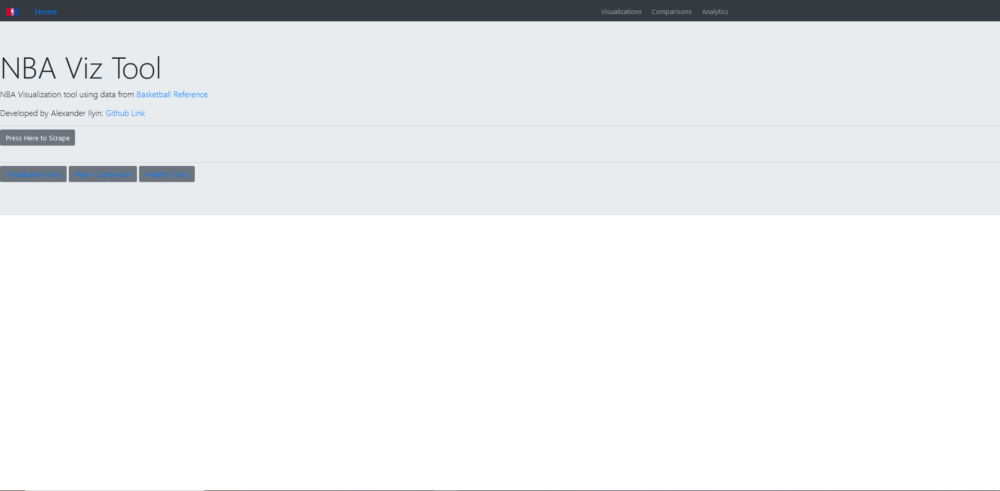
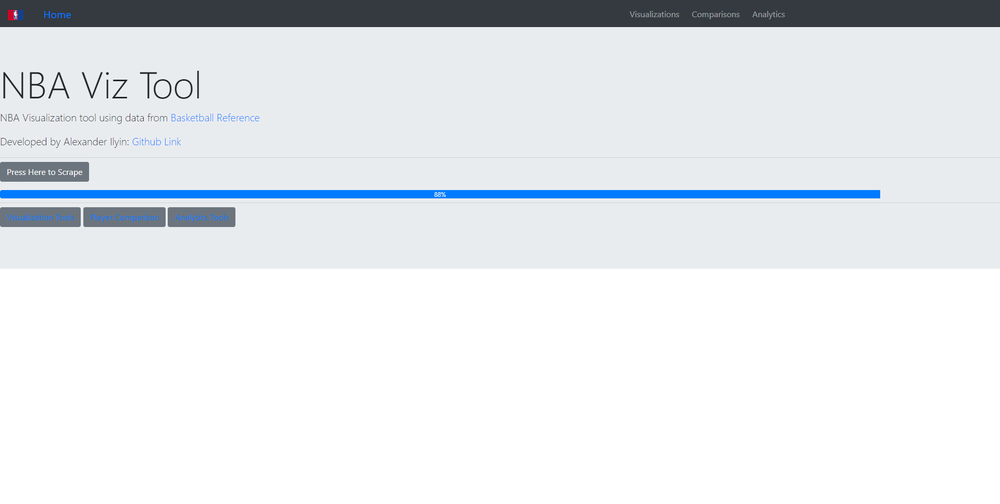
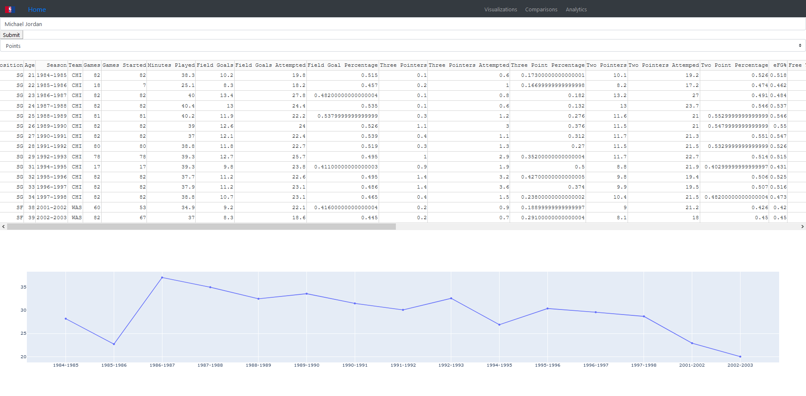
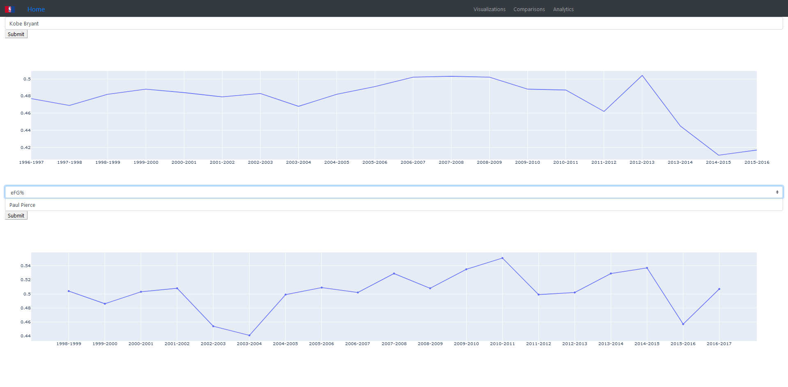

# NBA_data_mine
With the NBA season postponed indefinitely, fans have turned to other channels of basketball-media consumption to "cope" with the lack of basketball action in recent weeks. Whether it is watching re-runs of their favorite playoff moments from years past or livestreams of classic NBA games, there are many ways to make up for the lack of live NBA games. One site that has risen in popularity over the years as a competitor to NBA owned websites is Basketball Reference. What started out as a low level basketball statistics database has now grown into the most recognizable basketball-related websites for NBA fans. 

While Basketball Reference is still the top destination for basketball stats, one thing that it lacks is visualizations. With so much data accumulated in once space, the potential has always been ther but never executed. For this reason, I have created this visualization tool to use data from Basketball Reference in order to create a method for visualizing different basketball statistics. To complete this task, I have used Plotly's dashboard building package - Dash. Dash provides to ability to create powerful dashboards using Plotly visualizations. Note: The owner of Basketball Reference is against 'excessive' scraping of their site, and for this reason I have not deployed the scraper itself. 

## Data Collection
My data collection method involved the use of a BeautifulSoup/Selenium to visit many different Basketball Reference pages and collect yearly averages of all players in the NBA. Specifically, I focused on the years 1960-2019, as 1960 was around the year the NBA recorded more stats and awards (will be relevant for future predicitive analytics tasks). BeautfiulSoup provides an easy method for parsing HTML data, while Selenium allows for the creation of a "ghost browser" that has the ability to click on links, circumvent and navigate sites with Javascript elements. Basketball Reference has a multitude of different forms of basketball statistics, ranging from pages dedicated to invdividual players to pages containining the stats of different teams. Out of all the different forms of stats available on Basketball Reference, I decided that compiling data from season-wide averages over the year range 1960-2019 would provide the best dataset for creating visualizations. 

## Building the Dashboard
While this wans't my first exposure to Dash, it was my first time trying to create a multi-paged dashboard. Since there were a couple of different tasks I was hoping to accomplish, trying to fit everything on one page would create a cluttered mess. Creating a multi-paged dashboard is not as easy as it may seem, and involves splitting source code over a collection of different files. The structure of this app is as follows:

-- scraper.py

-- Index.py

---- navbar.py

---- homepage.py

---- player_viz.py

---- pcomp.py

Each individual file contains the layout of its corresponding page. For example, player_viz.py contains all the layout information for all the elements that will be present on the player visualization page. What complicates the file structure is Dash's Callbacks, or functions that enable interactive features of Dash. Each callback function communicates with an arbitrary number of Dash elements using an id tag. With this in mind, it is intuitive that the callback function would be contained within the layout files. However, this is not the case, as the callback functions do not function unless they are in the central file, Index.py. For this reason, Index.py contains the callback functions needed for each of the pages (homepage, player vizualizations, player comparisons, analytics). This file compiles the backbone of the application, and contains the logic needed for multi-page navigation. The if/elif loop at the end of the file reads the current url and displays the corresponding layout. The homepage of the dashboard looks as follows:

Pressing the scrape button causes the scraping script to run in the background and produces a loading bar that tracks the progress. Using the Dash loading/progress elements, the progress is calculated by taking the percent of files that are loaded at a particular point in time over the total target of 59. The progress bar looks like:

The homepage of the dashboard contains links to the different pages of the app, which can also be accesses using the navbar located at the top of the screen. An interesting note about the structure of the dashboard is the navbar.py file. While the navbar had its own dedicated file, it had to be called on every page of the app. The first feature of this dashboard is the ability to look at a single player's stats. This page displays all the career average for all NBA players on the Basketball Reference site, and allows for the visualization of any of the stats. One thing to note is that some players appear more than once in a season table. The reason for this is trades or free agency signings. A player can start the year playing for one team, before being traded or being released/signing for another team. Players who fit this criteria have stacked data points in these seasons. For example, here are Michael Jordan's stats over his career as a table, as well as a line plot of his points-per-game averages:

Next was the player comparison tool, which allows for the comparison of players by a chosen statistic. Due to concerns of cluttering, the stats table has been witheld from this page. 

## Challenges
The method of data collection proved to be the biggest challenge in this app. I spent an unproportionate amount of time writing the scraping script relative to the amount of data that was collected in the end. The reason for this is various quirks in the Basketball Reference source code that confused BeautifulSoup and Selenium. Note, the script may not work if there are any updates to Basketball Reference, which is possible due to the sheer volume of scraping tools available online. 

## Future Work
There is one tab that I have yet to address: analytics. The intial goal of the project was to use predictive analytics on basketball data, but this dashboard was created as a tangent from the original path of this project. My future work will involve adding interactive predictive analytics features to the dashboard, and should allow for users to gain insights from the vast amount of data available on Basketball Reference. With the prevelance of analytics growing in the NBA, predictive analytics can be used by teams to get an upper hand over their competition. 
